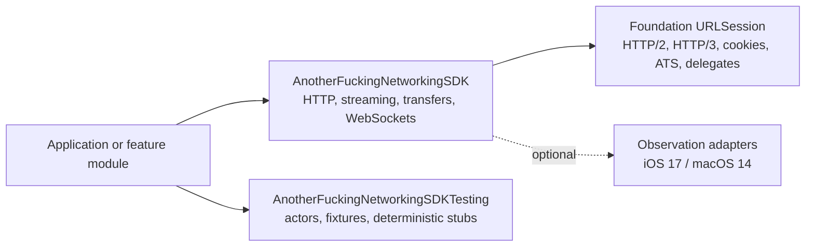

# AnotherFuckingNetworkingSDK documentation

This documentation is the durable guide for adopting, extending, and
reviewing the SDK. The root [README](../README.md) is the concise API tour;
these pages explain decisions, lifecycle contracts, and operational tradeoffs.

## Start here

| Need | Guide |
| --- | --- |
| Add the package and make a first request | [Getting started](getting-started.md) |
| Understand the architecture and ownership model | [Architecture](architecture.md) |
| Reason about Swift concurrency and cancellation | [Concurrency and lifecycle](concurrency-and-lifecycle.md) |
| Add bearer auth, refresh, and retries safely | [Authentication and retries](authentication-and-retries.md) |
| Build WebSockets and file transfers | [WebSockets and transfers](websockets-and-transfers.md) |
| Persist and resume transfer jobs | [Background and resumable transfers](background-transfers.md) |
| Export operation metrics safely | [Telemetry and metrics](telemetry.md) |
| Add reconnect and heartbeat policy | [WebSocket reliability](websocket-reliability.md) |
| Share duplicate concurrent reads | [Request coalescing](request-coalescing.md) |
| Review secrets, TLS, redaction, and pinning | [Security](security.md) |
| Test, benchmark, release, and review changes | [Testing and release](testing-and-release.md) |
| Track planned capability modules | [Roadmap](roadmap.md) |

## Current package map

## Supported baseline

- Swift 6 language mode and strict concurrency validation.
- iOS 15 and macOS 12 package deployment targets.
- Foundation `URLSession` is the transport; the SDK does not replace the
  system HTTP, TLS, cookie, redirect, or HTTP/3 implementations.
- Observation adapters are availability-gated; the core remains usable on the
  minimum deployment targets.

## Documentation conventions

- “Must” describes a public behavior or invariant covered by tests.
- “Should” describes the recommended application integration pattern.
- “Roadmap” describes deliberately separate work that is not yet shipped.
- Examples use the public API unless a page explicitly says it is test-only.
