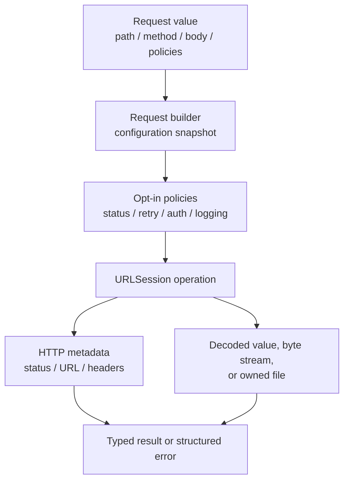
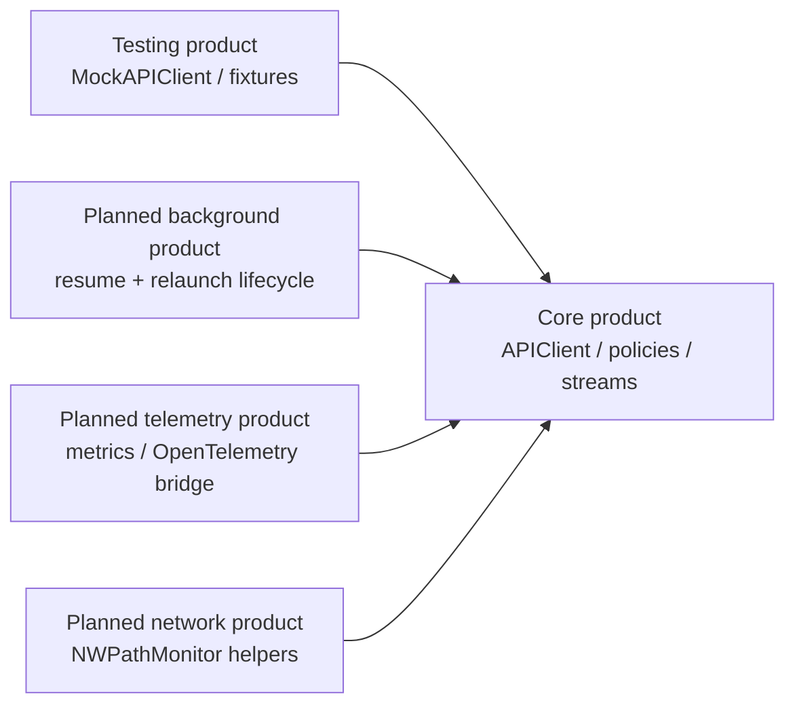
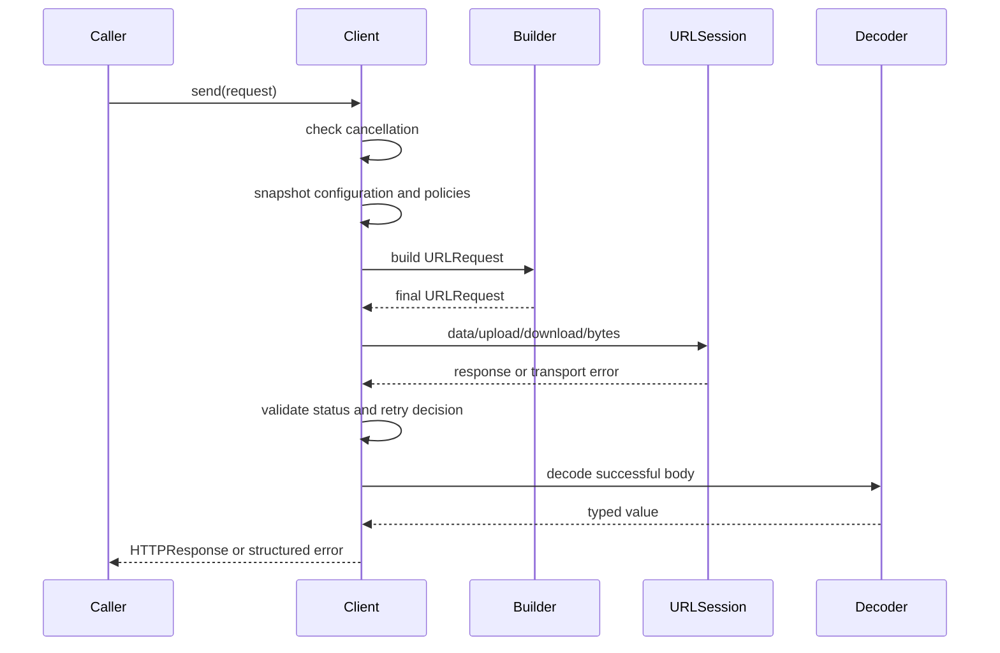

# Architecture

## Design goals

The SDK is a thin, typed policy layer over Foundation. It should make common
requests pleasant without hiding the lifecycle and failure details that matter
for production applications.

## Products and boundaries

The current package has two products. The production product must remain free
of test-only dependencies; the testing product may depend on production types.
Future lifecycle-heavy capabilities should remain separate products instead of
turning `APIClient` into a global coordinator.

## Request lifecycle

Every ordinary request follows the same high-level path:

The configuration snapshot happens before the first transport suspension.
Request customization runs last so it can sign or refine the prepared
`URLRequest`. Retry decisions use the final method where the transport can
observe it; authentication replay has its own explicit safety policy.

## Policy composition

Policies are values or wrappers, not hidden global switches:

- `HTTPStatusPolicy` decides whether a status is accepted.
- `HTTPRetryPolicy` decides whether a failed attempt may be replayed.
- `AuthenticatedAPIClient` adds credentials and a bounded 401 recovery policy.
- `NetworkActivityMonitor` and `NetworkingLogger` are opt-in observers.
- `NetworkTelemetry` emits privacy-safe operation and attempt events without
  coupling the core to a metrics vendor.
- WebSocket buffering and lifecycle policies are captured at connection open.

This keeps the default client fast and avoids forcing cache, telemetry,
reachability, or authentication onto applications that do not need them.

## Data ownership

| Resource | Owner after API returns | Cleanup rule |
| --- | --- | --- |
| `HTTPByteStream` | Caller/consumer task | EOF, failure, task cancellation, or `cancel()` |
| `.temporary` download | Caller | Remove the returned file when finished |
| `.file` download | Caller-selected destination | Existing files are preserved unless overwrite is explicit |
| `.file` upload | Caller | SDK validates before each replay; it never deletes the source |
| WebSocket connection | Caller | Close explicitly or let cancellation close the transport |

## Performance posture

The ordinary client path avoids actor hops and observer work unless an adapter
is injected. Response streams are single-pass and do not accumulate bodies.
Multipart is currently memory-backed; use file uploads for large raw bodies and
track the streaming multipart module separately on the [roadmap](roadmap.md).

Do not implement a custom HTTP/2, HTTP/3, TLS, cookie, or redirect stack.
Foundation already owns those protocol concerns and can evolve them with the
operating system.
