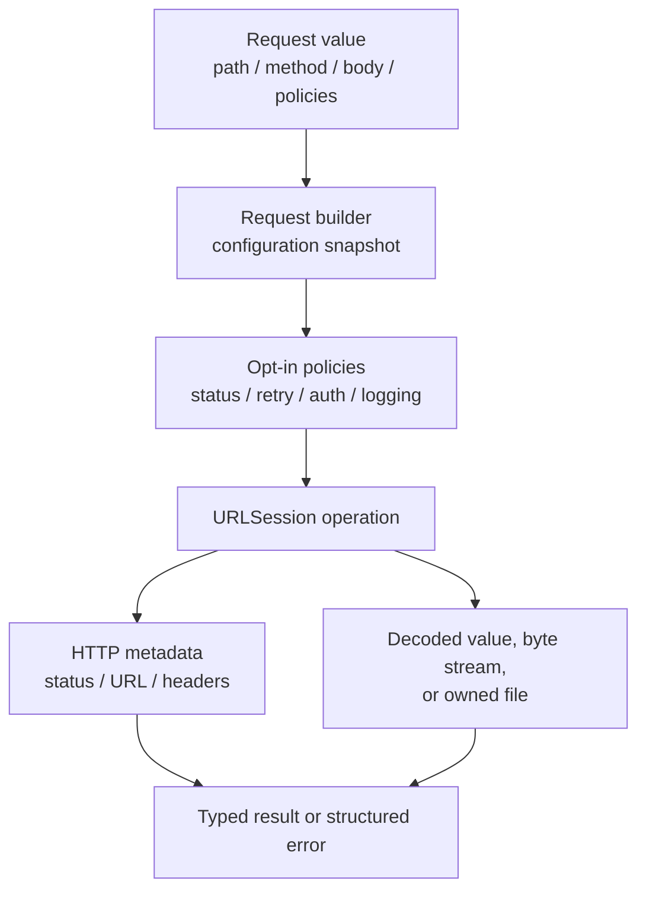
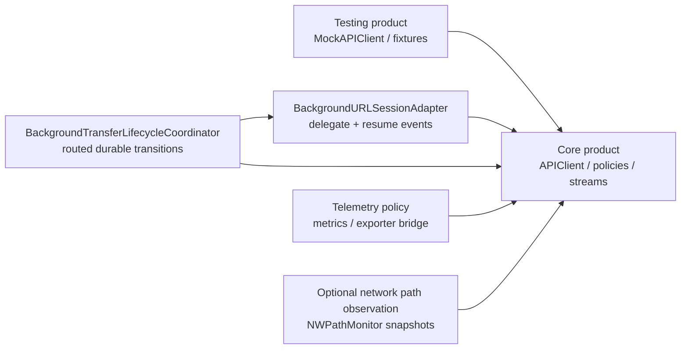
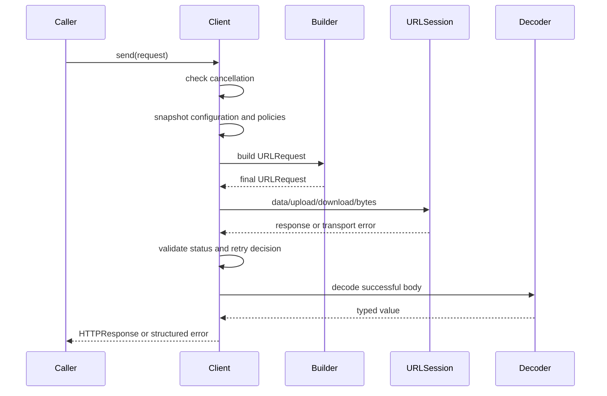

# Architecture

## Design goals

The SDK is a thin, typed policy layer over Foundation. It should make common
requests pleasant without hiding the lifecycle and failure details that matter
for production applications.

## Products and boundaries

The current package has two products. The production product must remain free
of test-only dependencies; the testing product may depend on production types.
Future lifecycle-heavy capabilities should remain separate products instead of
turning `APIClient` into a global coordinator.

## Request lifecycle

Every ordinary request follows the same high-level path:

The configuration snapshot happens before the first transport suspension.
Request-specific customization runs first, followed by the optional global
`APIClient.Configuration.requestCustomizer`, so an application-wide policy can
inspect and enforce the final `URLRequest` for every HTTP transport operation
and WebSocket upgrade. WebSocket upgrades then run stricter validation so
Foundation-owned upgrade fields cannot be overwritten by a general hook.
Retry decisions use the final method where the transport can observe it;
authentication replay has its own explicit safety policy.

## Policy composition

Policies are values or wrappers, not hidden global switches:

- `HTTPStatusPolicy` decides whether a status is accepted.
- `HTTPRetryPolicy` decides whether a failed attempt may be replayed.
- `AuthenticatedAPIClient` adds credentials and a bounded 401 recovery policy.
- `NetworkActivityMonitor` and `NetworkingLogger` are opt-in observers.
- `NetworkTelemetry` emits privacy-safe operation and attempt events without
  coupling the core to a metrics vendor.
- Ordinary HTTP delegates, transfer delegates, and Foundation WebSocket task
  delegates forward timing-only metrics through the same telemetry context.
- `CachedAPIClient` and `ConditionalCachedAPIClient` provide bounded,
  caller-keyed response reuse; the conditional decorator owns validator
  revalidation without imposing cache semantics on the base client.
- `CircuitBreakingAPIClient` composes actor-isolated keyed failure suppression
  around response operations; injected clocks and classifiers keep cooldown and
  trip semantics deterministic and policy-owned.
- `BackgroundURLSessionAdapter` translates platform delegate callbacks while
  `TransferJobCoordinator` remains the durable state owner.
- `BackgroundTransferLifecycleCoordinator` composes the actor-isolated router
  and durable coordinator. It starts relaunch-restored jobs, applies monotonic
  progress, and invokes an application-owned destination commit before
  terminal success.
- Its relaunch reconciliation report validates live task descriptors against
  restored durable jobs and separates orphaned tasks from direction
  mismatches before any callback is applied. It also reports non-terminal
  durable jobs with no valid task so recovery can re-enqueue them explicitly.
- BackgroundTransferTaskControlError and the adapter's async pause/cancel/
  resume methods make relaunch races explicit while keeping bounded resume data
  and durable job transitions in separate ownership domains.
- BackgroundTransferResumeDataValidator provides bounded validation with an
  opt-in property-list integrity check; the default remains format-agnostic so
  future Foundation resume-data formats are not rejected by the SDK.
- WebSocket buffering and lifecycle policies are captured at connection open.
- WebSocketRecoveryAdapter composes an application-owned cursor/session
  protocol with bounded actor-isolated in-memory or atomic JSON state without
  making the transport core understand wire semantics.
- JSONWebSocketRecoveryAdapter adds an opt-in `Codable` seam over that opaque
  state; deterministic encoding and bounded decoding remain separate from
  reconnect and message replay policy.
- WebSocketMessageCodec adds an opt-in typed value seam over complete text or
  binary messages. Its decoded sequence delegates to the existing bounded FIFO
  and never creates a second receive pump.
- RequestConcurrencyLimiter is an actor-isolated FIFO permit policy for
  complete response operations. The response decorator does not claim stream
  or transfer conformance because those resources outlive the method call.
- ServerSentEventStream is a bounded framing adapter over HTTPByteStream;
  status/retry decisions stay in the HTTP layer while event parsing remains
  single-pass and cancellation-owned by the consumer.
- JSONLinesStream<Value> is the typed sibling for newline-delimited JSON;
  each record is bounded and decoded independently without changing the HTTP
  transport's ownership or retry semantics.
- NetworkPathMonitor is an opt-in newest-only observer; it never blocks
  requests or substitutes for URLSession connectivity policy.
- ObservableNetworkPath is a main-actor presentation adapter over those
  snapshots; path callbacks and transport work remain off the UI executor.

This keeps the default client fast and avoids forcing cache, telemetry,
reachability, or authentication onto applications that do not need them.

## Data ownership

| Resource | Owner after API returns | Cleanup rule |
| --- | --- | --- |
| `HTTPByteStream` | Caller/consumer task | EOF, failure, task cancellation, or `cancel()` |
| `.temporary` download | Caller | Remove the returned file when finished |
| `.file` download | Caller-selected destination | Existing files are preserved unless overwrite is explicit |
| `.file` upload | Caller | SDK validates before each replay; it never deletes the source |
| WebSocket connection | Caller | Close explicitly or let cancellation close the transport |

## Performance posture

The ordinary client path avoids actor hops and observer work unless an adapter
is injected. Response streams are single-pass and do not accumulate bodies.
`MultipartFormData` remains memory-backed for small forms;
`StreamingMultipartFormData` writes file parts in bounded chunks to an owned
temporary upload file. Background URLSession work is delegate-backed and
remains separate from the foreground `APIClient` request path.

Do not implement a custom HTTP/2, HTTP/3, TLS, cookie, or redirect stack.
Foundation already owns those protocol concerns and can evolve them with the
operating system.
