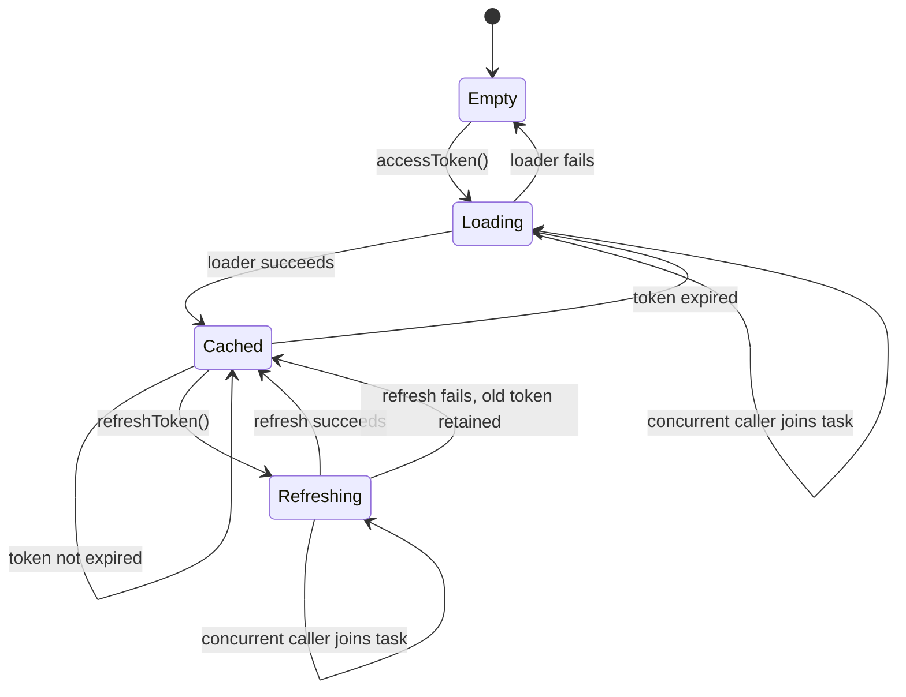
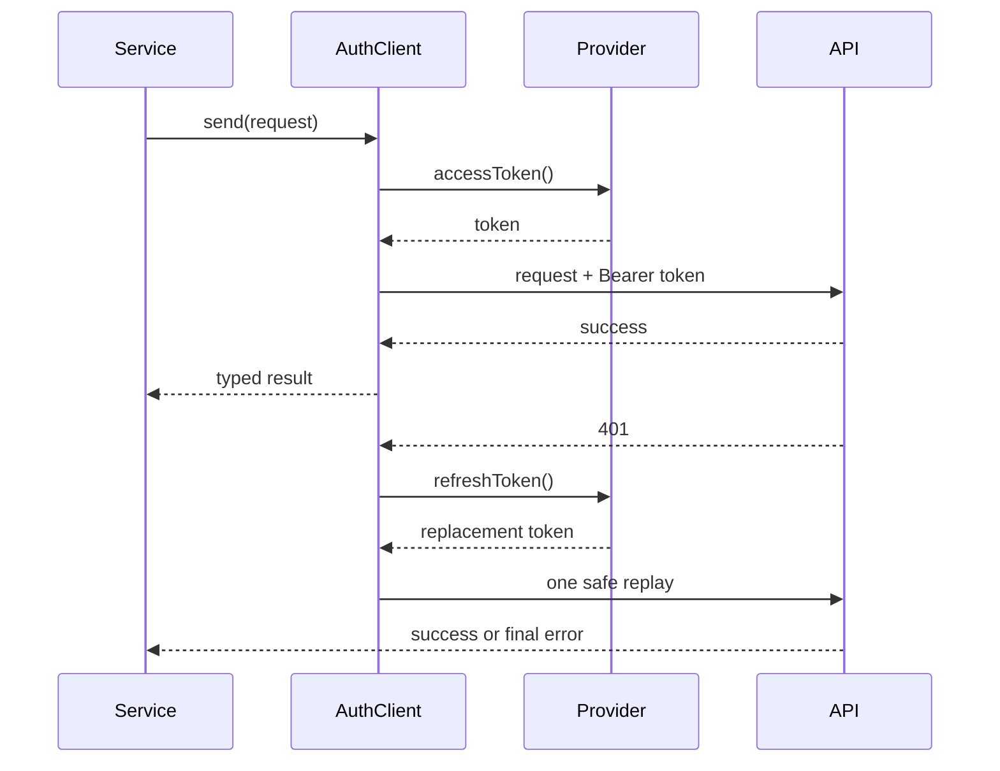

# Authentication and retries

## Token provider

`SingleFlightTokenProvider` is an actor with three states: no token, cached
valid token, and one in-flight load/refresh task.



The provider validates that returned tokens are nonempty and not already
expired. Keychain access, OAuth refresh, and secure credential storage belong
in the injected loader; the SDK does not persist secrets itself.

## Authenticated client flow



Authentication adds the header after endpoint customization, so a signer
cannot accidentally replace it. A 401 is refreshed and replayed at most once.
Accepted 401 statuses do not throw and therefore do not trigger refresh.

## Replay safety

| Request method/policy | 401 replay |
| --- | --- |
| GET, HEAD, PUT, DELETE, OPTIONS | Allowed by default |
| POST, PATCH, or custom method | Rejected unless `authenticationReplaySafety = .explicitlyReplayable` |
| Any request after a stream byte is exposed | Never |
| Request with an accepted 401 status | No refresh; caller receives the accepted response |

The explicit opt-in belongs on the request because only the endpoint owner can
assert idempotency keys or server-side deduplication. A retry policy and an
authentication replay policy are separate decisions; do not infer one from the
other.

## HTTP retry policy

Retries are disabled by default. A transient policy is bounded by maximum
attempts, maximum delay, status/URL error sets, jitter, and replay safety.
`Retry-After` takes precedence when valid and within the configured delay
budget. The final structured `HTTPFailure` is preserved when attempts are
exhausted.

Safe retry sequence:

```mermaid
flowchart TD
    Start["Attempt request"] --> Result{ "Transport or HTTP result" }
    Result -- success --> Return["Return result"]
    Result -- failure --> Policy{ "Policy allows replay?" }
    Policy -- no --> Throw["Throw final structured failure"]
    Policy -- yes --> Delay["Honor bounded Retry-After/backoff"]
    Delay --> Cancel{ "Cancelled?" }
    Cancel -- yes --> Cancellation["Throw CancellationError"]
    Cancel -- no --> Start
```

Never put non-idempotent mutations behind a broad global retry policy. Prefer
server idempotency keys and request-specific policies.
