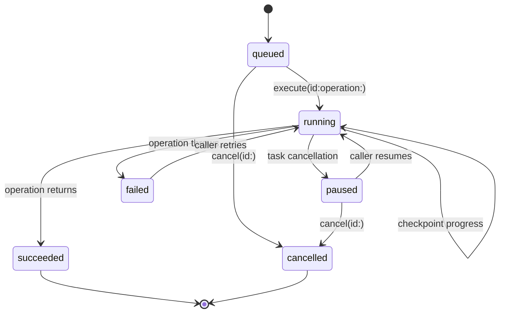

# Background and resumable transfers

The foreground `APIClient` transfer methods are intentionally simple and
durable at the file-ownership boundary. A background transfer has a second
problem: queue identity must survive process termination, while the request
value and platform session delegate remain application-owned. The SDK provides
the persistence and state-machine seam without pretending that a foreground
`URLSession` can continue after termination.

## Durable model

`TransferJob` is a `Codable`, `Sendable` record containing a stable UUID,
application-defined `requestKey`, direction, state, progress checkpoint,
optional resume data, destination URL, and the last error description. The
request key is deliberately opaque: on relaunch, resolve it from your own
database or dependency container rather than serializing arbitrary request
types.



`TransferJobCoordinator` persists each lifecycle boundary through
`TransferJobStore`. `InMemoryTransferJobStore` is useful for tests; use
`JSONTransferJobStore` for a small app-owned index. JSON writes are atomic and
run on the SDK's utility file-I/O queue.

## Integrating a background session

The operation closure is the bridge to the application or a future dedicated
background product. It receives the restored job and a checkpoint callback.
Checkpoint data can contain `URLSession` resume data or another bounded,
application-defined token.

```swift
let store = JSONTransferJobStore(fileURL: jobsURL)
let coordinator = TransferJobCoordinator(store: store)
try await coordinator.restore()

let job = TransferJob(
    kind: .download,
    requestKey: "export-42",
    destinationURL: destinationURL
)
try await coordinator.enqueue(job)

let finished = try await coordinator.execute(id: job.id) { job, checkpoint in
    let request = try await requestResolver(job.requestKey)
    let response = try await backgroundSession.download(
        request,
        resumeData: job.resumeData,
        progress: { progress, resumeData in
            Task {
                try? await checkpoint(TransferJobUpdate(
                    progress: progress,
                    resumeData: resumeData,
                    destinationURL: job.destinationURL
                ))
            }
        }
    )
    return TransferJobResult(
        bytesCompleted: response.bytesCompleted,
        totalBytes: response.totalBytes,
        destinationURL: response.fileURL
    )
}
```

The `backgroundSession` in this example is application code or a dedicated
platform adapter; it is not part of the foreground `APIClient` convenience
initializer. The adapter should own the `URLSessionConfiguration.background`
identifier, delegate rebinding, system completion handler, resume-data
validation, and destination commit. The coordinator owns durable job state and
must remain the single writer for that state.

## Cancellation and relaunch

Cancel the task awaiting `execute` to pause a running transfer. The coordinator
stores `.paused` and preserves the last checkpoint before rethrowing
`CancellationError`. A queued or paused job can be marked `.cancelled` with
`cancel(id:)`; running jobs must be cancelled through their executing task so
the transport receives the same cancellation signal.

On launch, call `restore()`, inspect `snapshot()`, resolve queued/paused jobs,
and execute them with a newly rebound session delegate. Do not automatically
resume every record without applying current authentication, destination, and
data-retention policy.

## Safety rules

- Keep resume data bounded and treat it as sensitive opaque transport state.
- Never delete an upload source as part of pause, retry, or cancellation.
- Do not mark a job succeeded until the destination commit has completed.
- Persist a checkpoint before waiting on long application-level work.
- Keep system background completion handlers separate from transfer progress
  callbacks; call the handler only after all delegate work is drained.
- Test relaunch and duplicate delegate callbacks with a real background-session
  integration target on each supported Apple platform.

The current module is a durable orchestration boundary, not a claim that every
Apple platform exposes identical background-session behavior. Platform-specific
delegate adapters remain on the [roadmap](roadmap.md).
