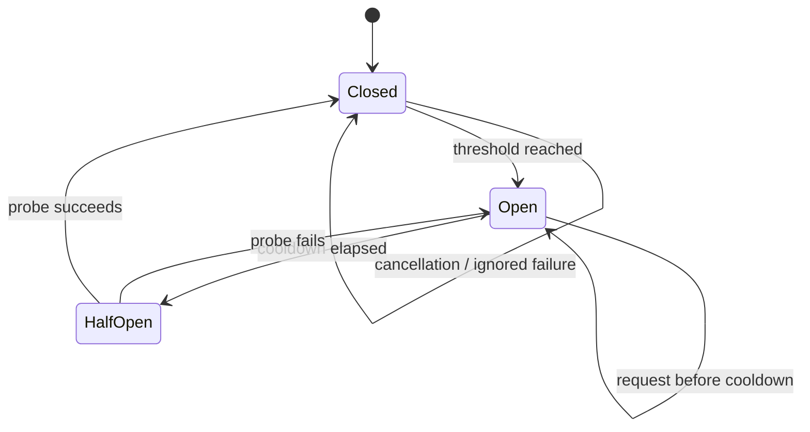

# Circuit breaker

`CircuitBreaker` is an actor-isolated policy for suppressing repeated failures
without changing Foundation's transport behavior. `CircuitBreakingAPIClient`
composes it around a response-capable client and keeps request keys caller-
owned.



## Configure the decorator

```swift
let breaker = CircuitBreaker(
    policy: CircuitBreakerPolicy(
        failureThreshold: 3,
        resetTimeoutNanoseconds: 10_000_000_000
    )
)

let client = CircuitBreakingAPIClient(
    client: apiClient,
    breaker: breaker,
    keyProvider: { request in
        // Include auth scope, tenant, locale, and feature flags when relevant.
        request.path
    }
)
```

The decorator supports typed requests and paginated responses. A `nil` key
bypasses the breaker for that operation. Keys are bounded to 256 UTF-8 bytes so
an untrusted input cannot grow the actor's state without limit.

## Failure and cancellation semantics

Only errors accepted by `failureClassifier` count toward the threshold. The
default classifier counts every thrown error; applications can ignore decoding
or validation failures when those should not suppress a host. Cancellation is
never counted and is rethrown unchanged.

```swift
let breaker = CircuitBreaker(
    policy: .init(failureThreshold: 2),
    failureClassifier: { error in
        !(error is DecodingError)
    }
)
```

After the cooldown, exactly one probe is admitted. Other callers receive
`CircuitBreakerError.open(retryAfterNanoseconds:)` until that probe succeeds or
fails. `status(for:)` exposes only bounded state and timing; it never includes
request URLs, response bodies, or error text.

Inject the clock in tests to make cooldown transitions deterministic. The
breaker is intentionally not a retry loop: combine it with the SDK's bounded
`HTTPRetryPolicy` and telemetry when the product needs both per-operation
replay and endpoint-level failure suppression.
