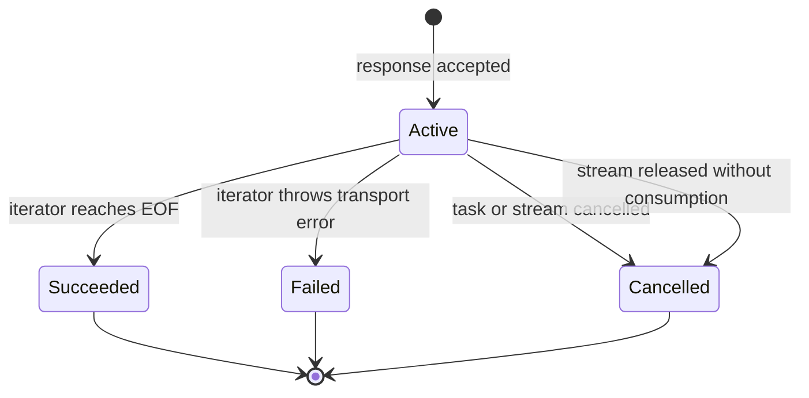

# Concurrency and lifecycle

## Swift 6 contract

Public request, response, policy, error, metadata, and fixture values are
`Sendable`. `APIClient` is a synchronized reference type and can be shared
across tasks. `MockAPIClient` is an actor so test state is isolated by the same
rules as production state.

Use an actor for asynchronous mutable state such as token caches or reconnect
state. Use `CriticalState` only for short synchronous mutations that must not
await. Never hold a lock across URLSession, file, or user-supplied async work.

## Cancellation checkpoints

The safe pattern is:

```mermaid
flowchart TD
    A["Enter API"] --> B["Task.checkCancellation"]
    B --> C["Build request / validate inputs"]
    C --> D["Suspend in URLSession or async provider"]
    D --> E["Check cancellation after suspension"]
    E --> F{ "Irreversible commit?" }
    F -- no --> G["Return or throw CancellationError"]
    F -- yes --> H["Finish serialized commit"]
    H --> I["Return committed resource"]
```

Cancellation must not become a retryable transport error. A cancellation that
arrives while a download is being moved into its final destination is handled
by the commit boundary: pre-commit cancellation removes the owned temporary
file, while a completed move returns the resulting URL.

## Streams

`HTTPByteStream` owns a URLSession byte task and has a single-pass iterator.
When an activity monitor is injected, the stream keeps the operation active
until one of these terminal events:



Do not create a second consumer for a stream. If a consumer needs fan-out,
build a bounded actor-owned broadcaster above the stream and document its
buffering policy.

## Observation and activity

`NetworkActivityMonitor` publishes privacy-safe snapshots with newest-only
buffering. It contains counts and outcomes, never URLs, headers, bodies, or
underlying errors. Observation adapters are availability-gated and should
remain views over the same bounded source rather than a second state machine.

## File ownership

File operations are isolated behind `FileIOExecutor`. The executor prevents
blocking filesystem work from accidentally running on an actor's serial
executor, while committed cleanup still runs when its awaiting task is
cancelled. Test cleanup must verify both successful and cancelled paths.

## Review checklist

- Is every new public value `Sendable` or intentionally isolated?
- Are all mutable fields protected by an actor or short critical region?
- Is cancellation checked before encoding, after transport, and before a
  retry or commit?
- Does a resource have one clear owner and terminal event?
- Is any buffer, error body, or multipart body explicitly bounded?
- Does Observation mirror production state rather than bypassing it?
