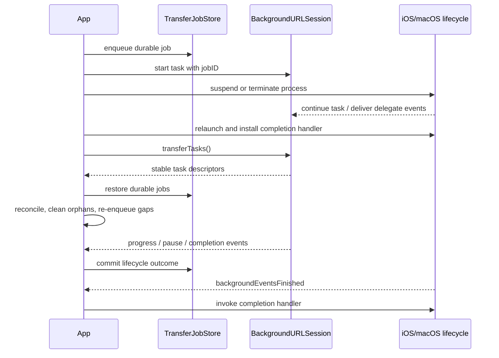

# Device and relaunch validation

Hosted CI proves strict compilation, library evolution, generic iOS/macOS
distribution builds, the first installed iOS Simulator, additional installed
Apple SDKs, and Mac Catalyst. It cannot prove OS termination, background task
handoff, protected-file behavior, or radio transitions on a physical device.
Use this runbook for the final release gate of an app integrating the SDK.

## Prepare a device build

1. Use a real iOS device on a supported deployment target and a signed host
   app. For macOS, use a signed app with a unique background session identifier.
2. Give the host app a stable `URLSessionConfiguration.background` identifier;
   do not derive it from a request URL, user input, or a temporary test value.
3. Persist `TransferJob` records in an app-owned location that survives app
   relaunch. Apply the app's file-protection and destination policy before
   starting a download.
4. Install the app with the debugger attached once, then repeat the scenarios
   with the debugger detached. The detached run is the meaningful termination
   test.

The SDK package itself has no app delegate and cannot supply signing,
background modes, or a destination policy. The host app must wire
`setBackgroundEventsCompletionHandler` to its lifecycle callback and keep the
adapter/delegate alive for the session's lifetime.

This repository includes a minimal signed-host fixture at
[Examples/BackgroundTransferHost](../Examples/BackgroundTransferHost/README.md).
It uses the SDK's durable coordinator, relaunch reconciliation, bounded
resume-data validation, and Observation-based UI. Build it unsigned for a
generic iOS compile gate; sign it with an integrating team's development
profile for the detached-device scenarios below.

## Required scenarios

| Scenario | Expected evidence |
| --- | --- |
| Foreground download completes | Temporary file is committed before `.succeeded`; destination is readable after the operation. |
| Process is suspended while downloading | On relaunch, `transferTasks()` returns the task and `reconcile(adapter:)` returns one validated route. |
| Process is terminated while downloading | Durable job remains non-terminal; relaunch restores it without duplicate route bindings. |
| Download is paused | `pauseDownload` returns bounded resume data; `TransferJobCoordinator.pause` persists it. |
| Paused task resumes | A new or resumed task reports monotonic progress and commits exactly once. |
| Task disappears before control | `BackgroundTransferTaskControlError.taskNotFound` is handled as a relaunch race, not as a successful cancellation. |
| Orphan task appears | It is reported and cleaned only by explicit app policy. |
| Durable job has no task | `jobsWithoutTasks` is re-enqueued after current auth/destination checks. |
| Background events finish | The app completion handler runs only after `backgroundEventsFinished` is routed. |
| WebSocket path changes | Reliability policy reconnects with bounded attempts; recovery state is restored only after the replacement handshake. |

Capture task identifiers, durable job states, route reports, and terminal
outcomes in a private device log. Do not capture authorization headers, cookie
values, response bodies, recovery payloads, or full URLs.

## Release evidence

Attach the following to a release candidate or app integration PR:

- device model, OS version, SDK commit, and host-app build number;
- whether the debugger was attached or detached;
- route/relaunch reports with IDs redacted or hashed;
- final durable job state and destination-commit result;
- any radio, protected-storage, or server-throttling conditions exercised.

If a physical device is unavailable, keep the release gate open and report the
missing evidence explicitly. Do not convert simulator or generic product
builds into a claim of background execution after OS termination.
