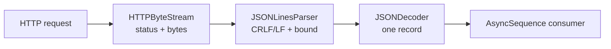

# JSON Lines and NDJSON

`JSONLinesStream<Value>` decodes one bounded JSON value per line from the
SDK's single-pass `HTTPByteStream`. It is suitable for exports, event feeds,
and incremental APIs that use `application/x-ndjson` or another newline-
delimited JSON contract.



## Typed consumption

```swift
struct ExportRecord: Decodable, Sendable {
    let id: String
    let value: Int
}

let records = try await client.streamJSONLines(
    ExportRequest(),
    as: ExportRecord.self,
    maximumLineBytes: 128 * 1_024
)

for try await record in records {
    store(record)
}
```

Status and replay-safe retry decisions finish before the stream is returned.
After the first record is exposed, the stream is single-pass; cancelling the
consumer propagates to the underlying URLSession byte task. `cancel()` is also
available when an owner must stop iteration explicitly.

## Framing and limits

The parser accepts LF and CRLF line endings and ignores blank lines. A final
line does not need a trailing newline. Each record is decoded independently,
so a malformed record throws `JSONLinesError.decodingFailed` without exposing
decoder internals or retaining prior records. The default line limit is 256
KiB; lower it for a product-specific memory budget. Oversized input throws
`JSONLinesError.lineTooLarge` before decoding.

The adapter does not enforce a `Content-Type`; validate the server contract in
the request/service layer when required. It also does not reconnect or replay
records. Pair it with an application-owned cursor/retry policy for long-lived
feeds, and preserve `CancellationError` as caller intent.
