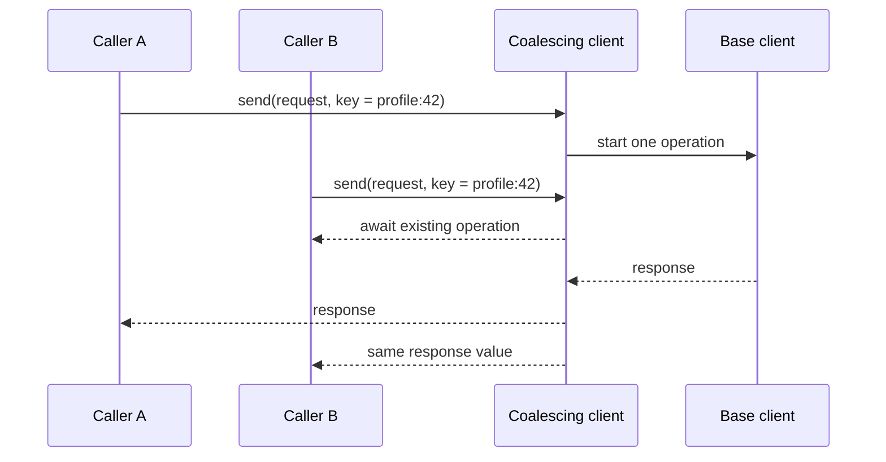

# Request coalescing

`RequestCoalescingAPIClient` is an explicit single-flight decorator for typed
HTTP responses. Concurrent calls with the same caller-provided key share the
same underlying operation; the result is discarded when that operation ends.
It does not provide a response cache, stale data, offline behavior, or a
global deduplication policy.



## Configure a complete key

The key provider receives the original `HTTPRequest` existential. Include the
request type and every input that can alter the response: path, query, body,
headers, authentication scope, locale, and feature flags as appropriate.

```swift
let client = RequestCoalescingAPIClient(client: apiClient) { request in
    guard let request = request as? ProfileRequest else { return nil }
    return "profile:\(request.id):\(request.locale.identifier)"
}
```

Return `nil` for requests that must always execute independently. The wrapper
also coalesces paginated response calls using the same key provider.

Cancellation is caller-scoped: cancelling one waiter does not cancel the
shared underlying operation needed by other waiters. A cancelled caller gets
`CancellationError` at the next cancellation check. If the shared operation
fails, all current waiters receive the same failure and a later call may start
a fresh operation.

Do not reuse a key across incompatible request or response types. The wrapper
reports a typed `NetworkError.unknown` if a misconfigured key collides across
different value types.
