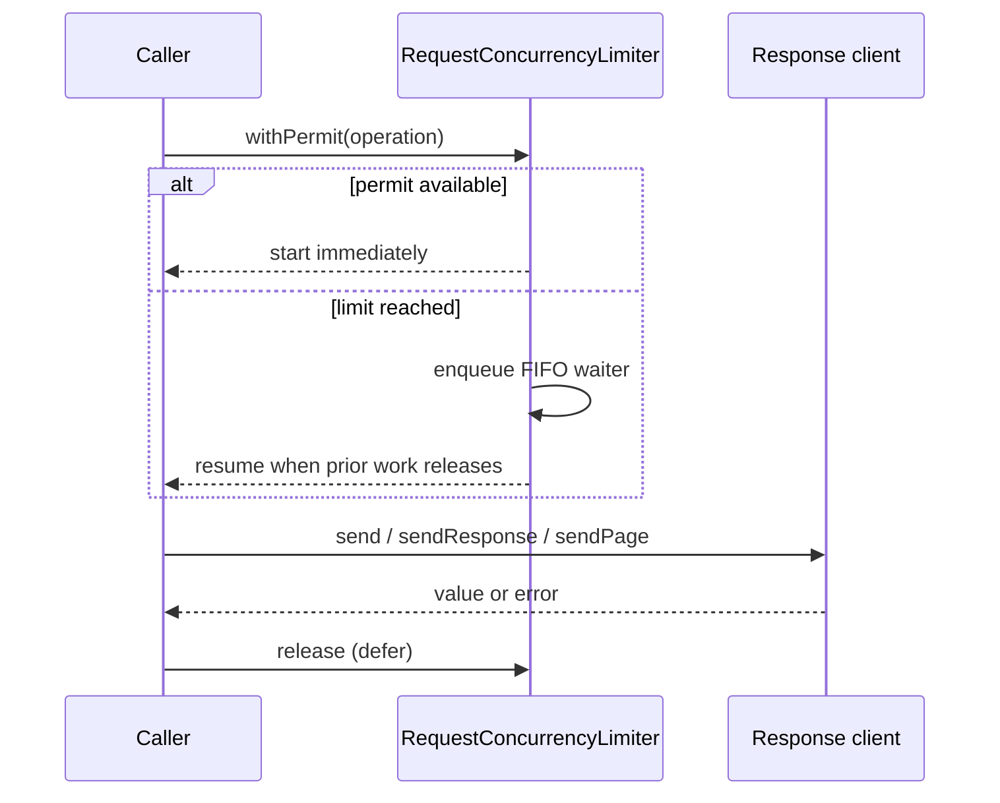

# Request concurrency limits

`RequestConcurrencyLimiter` provides a small actor-isolated policy for
protecting an API or service from an unbounded burst of concurrent response
requests. It grants permits in FIFO order, removes cancelled waiters, and
releases a permit whether the operation succeeds, fails, or is cancelled. The
waiting queue is bounded (128 entries by default), so overload fails with
`RequestConcurrencyLimiterError.queueFull` instead of retaining unbounded
caller state.

```swift
let limiter = try RequestConcurrencyLimiter(
    maximumConcurrentRequests: 4,
    maximumQueuedRequests: 128
)
let limitedClient = ConcurrencyLimitedAPIClient(
    client: client,
    limiter: limiter
)

let response = try await limitedClient.sendResponse(
    GetUserRequest(userID: 42)
)
```

The permit covers the complete response operation, including the underlying
transport's retries and decoding. `activeRequestCount` and
`waitingRequestCount` are actor-isolated diagnostics that can be sampled for
telemetry or tests; they do not expose requests, URLs, bodies, or credentials.

## Cancellation and composition

Cancelling a caller that is waiting removes it from the FIFO and preserves
`CancellationError`. Cancelling an operation that already holds a permit runs
the operation's normal cancellation path and releases the permit afterward.
The limiter does not retry or reorder work.

`ConcurrencyLimitedAPIClient` conforms to `APIClientResponseProtocol`, so it
can be composed with authentication, coalescing, caching, and circuit-breaker
decorators. Put the limiter at the boundary whose work should be bounded; for
example, place it outside a circuit breaker when rejected/open calls should
not consume a permit.

The decorator intentionally does not conform to the streaming or transfer
protocols. Those APIs return a byte stream or file operation whose lifetime
extends beyond the method call; holding a request permit only until the stream
is returned would make the limit inaccurate. Use `limiter.withPermit` around a
fully owned application operation or add a resource-lifetime-aware policy for
those cases.


