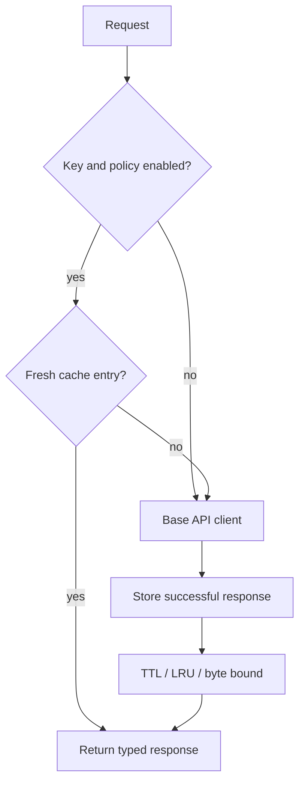

# Response caching

`CachedAPIClient` adds an explicit, bounded in-memory cache for successful
typed responses. It uses caller-provided keys, TTL expiration, LRU eviction,
and a byte budget. Completed responses remain only in the decorator that owns
the cache; there is no process-wide cache.



```swift
let client = CachedAPIClient(
    client: apiClient,
    policy: ResponseCachePolicy(
        maximumEntries: 128,
        maximumBytes: 8 * 1_024 * 1_024,
        timeToLive: 60
    ),
    keyProvider: { request in
        guard let request = request as? ProfileRequest else { return nil }
        return "profile:\(request.id):\(request.locale.identifier)"
    }
)
```

Keys must include the request type and every response-varying input, including
authorization scope, locale, feature flags, and body semantics. Return `nil`
for requests that must always hit the network. Only successful responses are
stored; failures and cancellation are never cached.

Writes do not invalidate reads automatically. After a successful mutation,
invalidate the affected key or clear the decorator:

```swift
await client.invalidate("profile:42:en_US")
await client.removeAllCachedResponses()
```

Compose `CachedAPIClient` outside `RequestCoalescingAPIClient` when a cache miss
should also share one in-flight request:

```swift
let coalesced = RequestCoalescingAPIClient(client: cached) { request in
    // Return the same complete key used by the cache.
    cacheKey(for: request)
}
```

This module intentionally does not synthesize conditional `If-None-Match`
requests or treat `304 Not Modified` as a universal success. Applications that
need validators can add them in `HTTPRequest.customize(_:)` and define their
own status policy while retaining the explicit cache bounds.
