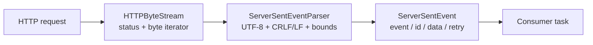

# Server-Sent Events

`ServerSentEventStream` is a bounded parser over the SDK's single-pass
`HTTPByteStream`. It adds event framing without creating a second transport
implementation or buffering an entire response.



## Consume a stream

```swift
let bytes = try await client.stream(EventRequest())
let stream = ServerSentEventStream(bytes: bytes)

do {
    for try await event in stream {
        switch event.event {
        case "message":
            handle(event.data)
        case "snapshot":
            applySnapshot(event.data)
        default:
            logUnknownEvent(event)
        }
    }
} catch is CancellationError {
    // Caller intent: do not reconnect here unless the product asks for it.
}
```

The source status and headers remain available before iteration. The adapter
does not enforce a `Content-Type`; validate that policy in the request/service
layer when the server contract requires `text/event-stream`.

## Wire and memory rules

The parser supports LF and CRLF line endings, ignores comment lines, joins
consecutive `data:` fields with a newline, defaults missing event names to
`message`, and accepts a non-negative integer `retry:` value in milliseconds.
Events without a `data:` field are not emitted, matching the SSE dispatch
rule. Invalid UTF-8, NUL-containing IDs, and malformed retry values are
handled explicitly rather than silently replacing bytes.

The default event limit is 256 KiB. Set `maximumEventBytes` lower for a
product-specific budget; the parser throws `eventTooLarge` before retaining
more than the configured bound. This limits one event, not the lifetime of the
stream, so long-lived connections remain memory-stable.

```swift
let stream = ServerSentEventStream(
    bytes: bytes,
    maximumEventBytes: 64 * 1_024
)
```

`retryMilliseconds` is metadata only. The SDK does not automatically reconnect
or replay application messages from an SSE stream. Pair the parser with an
application-owned reconnect policy when the server contract defines one, and
keep cancellation as the terminal signal for a caller-owned stream.
