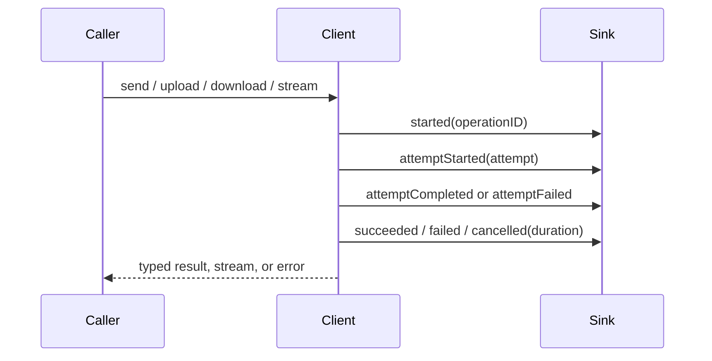

# Telemetry and metrics

Telemetry is opt-in and deliberately separate from logging. A telemetry event
contains an operation ID, operation kind, attempt number, lifecycle phase,
duration, status, bounded byte counts, and a coarse error category. It never
contains URLs, headers, bodies, tokens, or localized error strings.



## Install a sink

Pass `NetworkTelemetry` to `APIClient`. The sink must be fast and nonblocking;
move batching, persistence, and network export to a separate actor or task.

```swift
let telemetry = NetworkTelemetry { event in
    metricsActor.record(event)
}

let client = APIClient(
    baseURL: URL(string: "https://api.example.com")!,
    telemetry: telemetry
)
```

Request, upload, download, stream, and WebSocket handshake events share the
same operation-ID sequence for one client. Retry attempts have separate
`attemptStarted`, `attemptCompleted`, or `attemptFailed` events. Stream
operation completion is leased until EOF, cancellation, failure, or stream
deallocation rather than ending when the headers arrive.

## Exporter bridges

`NetworkTelemetryExporter` is a vendor-neutral bridge. An OpenTelemetry
adapter can map `operationID` to a span, `attempt` to a child span, status and
error categories to attributes, and duration to span timing. Keep the adapter
outside the SDK target so applications choose their exporter and sampling
policy.

`NetworkTaskMetricsSnapshot` is the stable event field for platform task
metrics. It is optional because Foundation does not expose identical metrics
for every async URLSession API and supported OS release. A platform adapter can
populate it from `NetworkTaskMetricsSnapshot(urlSessionMetrics)` when delegate
metrics are available; absence is not a failure. The adapter retains timing
values only and never retains URL, host, headers, or payload data.

## Performance and privacy

With no telemetry sink, the client does not allocate event values or read a
clock on the request path. With a sink, event delivery is synchronous on the
transport callback context, so the sink should only enqueue a small value. Do
not attach raw request data, response bodies, authorization headers, or full
URLs to exported attributes. Use the redacted logger separately when a human
diagnostic is needed.
