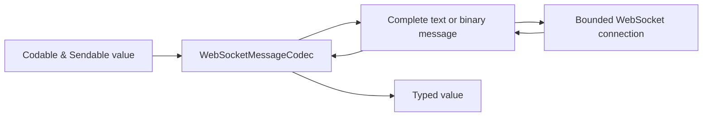

# Typed WebSocket messages

`WebSocketConnectionProtocol` keeps the transport-level message contract
explicit: a complete message is either text or binary. Applications often
want a typed value on top of that contract without giving the SDK ownership of
their protocol envelope. `WebSocketMessageCodec` provides that opt-in seam.

```swift
struct ChatEvent: Codable, Sendable {
    let kind: String
    let sequence: Int
}

let codec = JSONWebSocketMessageCodec<ChatEvent>()
let connection = try await client.connect(ChatSocket(roomID: "lobby"))

try await connection.send(
    ChatEvent(kind: "subscribe", sequence: 1),
    using: codec
)

let event = try await connection.receive(ChatEvent.self, using: codec)
for try await event in connection.decodedMessages(using: codec) {
    print(event.kind, event.sequence)
}
```

## Codec ownership

The codec owns only serialization. The connection continues to own
cancellation, one-receiver enforcement, bounded FIFO retention, close
semantics, and transport failures. A codec must be `Sendable`; its value must
be both `Codable` and `Sendable` because decoding happens in the consumer's
concurrency domain.

`JSONWebSocketMessageCodec` emits deterministic, sorted-key JSON as text by
default. Pass `encoding: .binary` when the server expects binary JSON. Decode
accepts either text or binary JSON, which allows a server to migrate its wire
representation without changing the client codec.

Malformed payloads produce the stable `WebSocketMessageCodecError.decodingFailed`
case. Encoding failures produce `.encodingFailed`; the underlying encoder
error is intentionally not exposed as a transport detail.

## Typed sequences and close behavior

`decodedMessages(using:)` is a typed view over the existing bounded
`messages` sequence. It does not create a second receive pump. Only one
consumer may receive from a connection at a time, and every decoded value
inherits the raw sequence's FIFO, cancellation, and close behavior. A normal
or going-away close ends the sequence after accepted messages drain; abnormal
closure is thrown.

For binary schemas, envelope protocols, or version negotiation, implement
`WebSocketMessageCodec` rather than modifying the transport. Keep protocol
limits and validation in the codec, and keep reconnect/session restoration in
`WebSocketReliabilityClient` or application policy.



