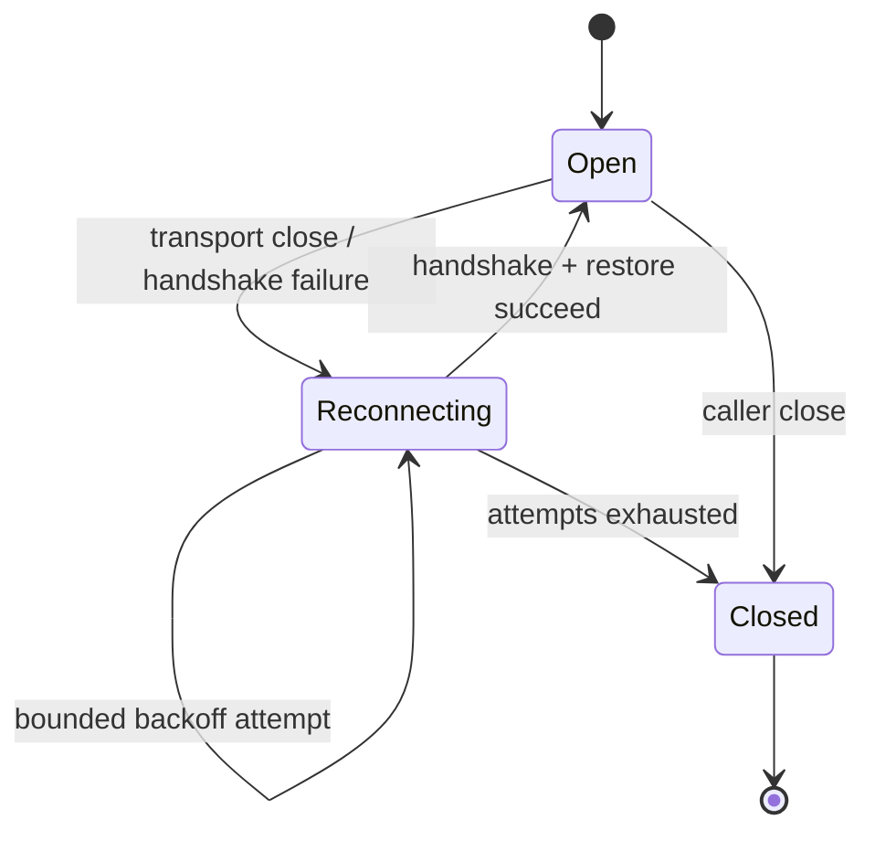

# WebSocket reliability policies

The base `WebSocketConnection` is intentionally one handshake, one bounded
receive pump, and no hidden reconnects. Add `WebSocketReliabilityClient` when a
product needs reconnect, heartbeat, or session restoration.



## Configure the wrapper

```swift
let reliable = WebSocketReliabilityClient(
    client: client,
    policy: WebSocketReliabilityPolicy(
        maximumReconnectAttempts: 4,
        initialBackoffNanoseconds: 250_000_000,
        maximumBackoffNanoseconds: 10_000_000_000,
        heartbeatIntervalNanoseconds: 30_000_000_000
    ),
    restorer: { connection in
        try await connection.send(.text("subscribe:room-42"))
    }
)

let connection = try await reliable.connect(ChatSocket(roomID: "42"))
```

When cursor recovery needs the reconnect attempt or the prior negotiated
session, use `restorerWithContext`. The context is bounded metadata; persist
the cursor or session token in an app-owned actor or database and send it only
after the replacement handshake succeeds.

```swift
let reliable = WebSocketReliabilityClient(
    client: client,
    restorerWithContext: { connection, context in
        let cursor = await cursorStore.load()
        try await connection.send(.text(
            "resume cursor=\(cursor ?? \"none\") attempt=\(context.attempt)"
        ))
    }
)
```

`send`, `receive`, and `ping` retry only transport, connection-closed,
handshake, and unknown transport failures. A successfully accepted send is not
replayed by the wrapper after a later error. The wrapper retries a receive
after reconnecting, so applications should make subscription and server-side
cursor restoration explicit in a restorer closure. `restorerWithContext` is
preferred when the server protocol needs the reconnect attempt or prior
subprotocol as part of that decision.

### Persisting protocol recovery state

The reliability wrapper intentionally does not interpret cursors or session
tokens. WebSocketRecoveryAdapter supplies a bounded, actor-isolated store
while leaving the wire format to the application:

~~~swift
let recovery = try WebSocketRecoveryAdapter(
    store: JSONWebSocketRecoveryStore(fileURL: recoveryURL),
    key: "room-42"
) { connection, context, state in
    let cursor = state.map {
        String(decoding: $0.payload, as: UTF8.self)
    } ?? "none"
    try await connection.send(text: "resume:" + cursor)
    try await connection.send(
        text: "attempt:" + String(context.attempt)
    )
}

let reliable = WebSocketReliabilityClient(
    client: client,
    restorerWithContext: recovery.restorerWithContext
)
~~~

Save new opaque state when the server acknowledges a cursor or session
checkpoint:

~~~swift
try await recovery.save(
    WebSocketRecoveryState(payload: Data("cursor-123".utf8))
)
~~~

State is limited to 64 KiB per key. JSON writes are atomic and cached after the
first read; use the in-memory store in tests. The SDK never logs, decodes, or
replays the payload, and applications should encrypt or redact sensitive
protocol state before persisting it.

## Backoff and heartbeats

Reconnect attempts are bounded by `maximumReconnectAttempts`, capped by
`maximumBackoffNanoseconds`, and jittered by `jitterRatio`. Inject the sleeper
and random source in tests; never use an unbounded retry loop. A heartbeat is
disabled by default. When configured, the wrapper sends `ping()` at the
interval and applies the same reconnect policy if the peer stops responding.

The wrapper exposes the existing `WebSocketConnectionProtocol` surface and
publishes bounded lifecycle states. A temporary reconnect does not terminalize
the state stream; a caller close or exhausted policy emits `.closed` and ends
the stream.

## Application responsibilities

- Restore authentication and subscriptions in `restorer`; do not blindly
  replay mutation messages.
- Persist a server cursor or session identifier when a product requires loss
  recovery; the SDK cannot infer application protocol semantics.
- Keep heartbeat intervals longer than the server's idle timeout but short
  enough to detect dead paths within the product's UX budget.
- Treat `CancellationError` as caller intent. Cancelling a send, receive, or
  reconnect backoff never starts another attempt.
- Keep the base connection for products that prefer explicit reconnect control.
