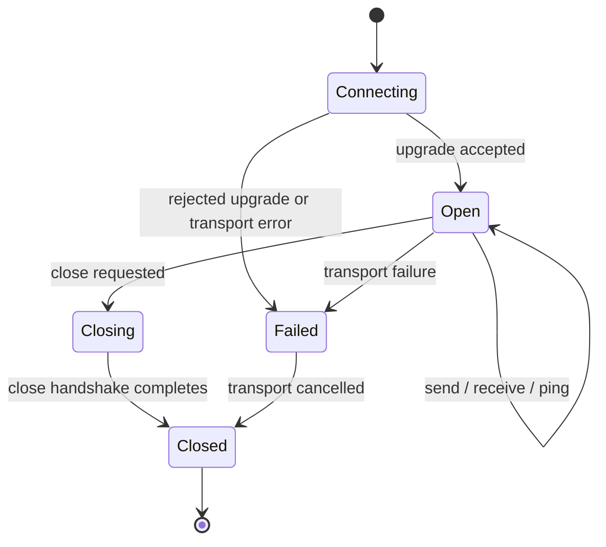
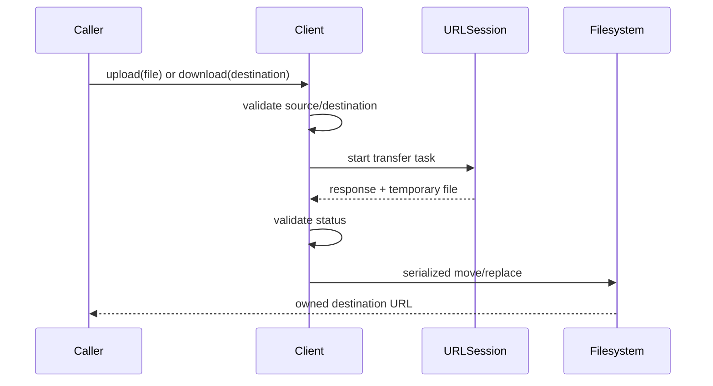

# WebSockets and transfers

## WebSocket lifecycle

`APIClient.connect` builds the handshake from the same base URL, global
headers, cookies, and URLSession as HTTP requests. After the upgrade, one
receive pump owns transport reads and publishes messages to bounded FIFO
storage.

The inbound buffering policy is captured when the connection opens. Overflow
fails closed rather than silently dropping messages. The connection state
sequence is bounded and Observation adapters mirror it when available.

The base connection deliberately does not reconnect or schedule heartbeats.
Those behaviors depend on product semantics (authentication, foreground state,
backoff, subscriptions) and belong in an application or policy wrapper.

## Message ownership

- A caller may send concurrently; the transport serializes URLSession task
  interaction as required by the connection state machine.
- Only the internal receive pump reads from the URLSession task.
- Consumers receive messages in FIFO order.
- Cancellation of a receive closes the connection and preserves
  `CancellationError`.
- Close is idempotent; peer close details remain available in lifecycle state.

## Foreground file transfers

Foreground downloads move Foundation's temporary file into `.temporary` or a
caller-selected `.file` destination. The SDK never deletes an upload source.
Failed response bodies are bounded; successful downloads are never loaded into
memory.

## Background and resumable roadmap

Background URLSession support is intentionally a separate lifecycle-bound
product. A complete implementation must persist transfer identity, rebind a
delegate after app relaunch, handle the system-provided background completion
handler, and expose resume data. Do not advertise foreground downloads as
relaunch-safe. See [Roadmap](roadmap.md) for the planned module boundary.
